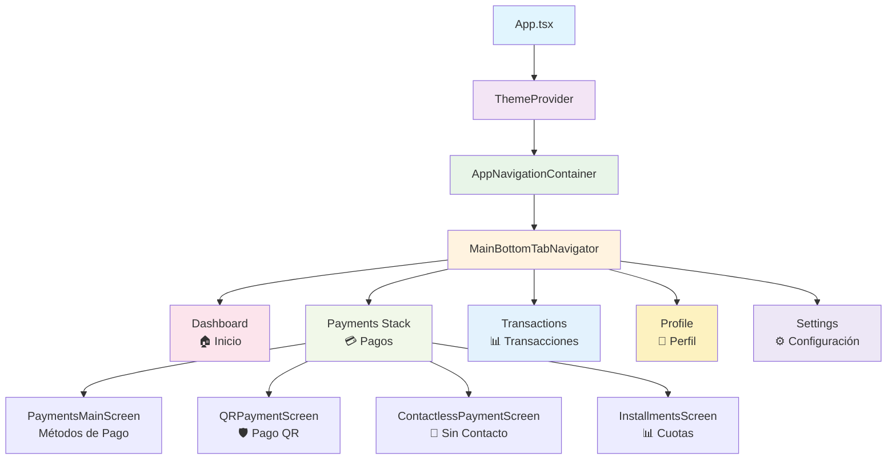

# Arquitectura de Navegación - App de Adquirencia

## Diagrama de Flujo de Navegación

## Estructura de Navegación

### Navegación Principal (Bottom Tabs)
- **Dashboard** 🏠 - Pantalla principal con resumen
- **Payments** 💳 - Stack de métodos de pago
- **Transactions** 📊 - Historial de transacciones
- **Profile** 👤 - Perfil del usuario
- **Settings** ⚙️ - Configuración de la app

### Stack de Pagos
- **PaymentsMain** - Selección de método de pago
- **QRPayment** - Generación de códigos QR
- **ContactlessPayment** - Pagos NFC/contactless
- **InstallmentsPayment** - Pagos en cuotas

### Características
- ✅ Navegación adaptable por flavor/banco
- ✅ Temas dinámicos según configuración
- ✅ Feature flags para funcionalidades opcionales
- ✅ Componentes reutilizables
- ✅ Design system integrado